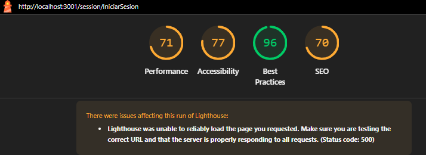

# TUCANES DEL SOFTWARE 

## Requisitos de instalacion 

- Node v14.17.4 o superior
- npm 6.14.14 o superior

## Proceso de instalacion (DEV)

    git clone https://github.com/ThinKreations/PlantMatica
    cd PlantMatica
    cd tucans-plantmatica
    npm install
    npm run dev

Este ultimo comando iniciara un servidor en modo desarrollo en el puerto 3000.

Para finalizar se debe ingresar a http://localhost:3000
----
### Integrantes de proyecto
- Arce Roldán Sergio Elías
- Castañeda Rodríguez Rafael Gil
- Flores Zamora Ithan Adrián
- Gutiérrez Villalobos José Alfredo
- Nápoles Munguía José de Jesús

## Migraciones

### Lighthouse testing in /

### Lighthouse testing in /session/IniciarSesion
